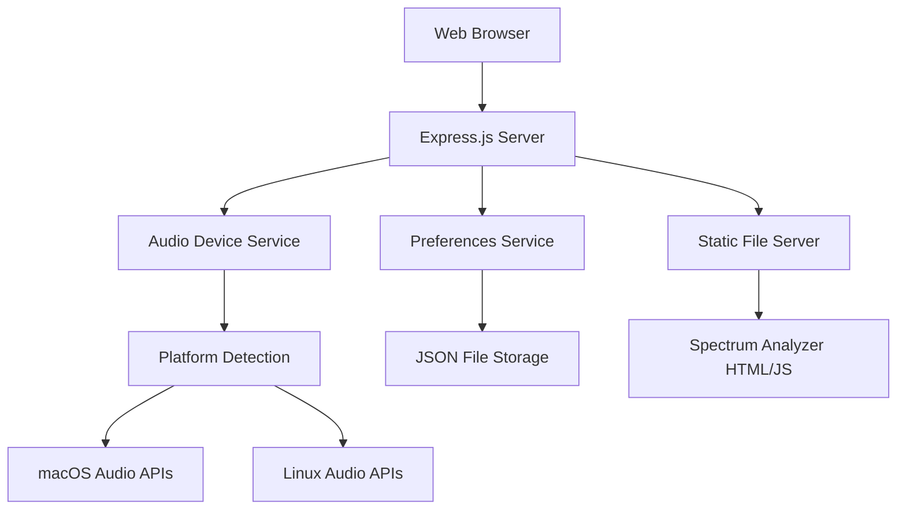

# Design Document

## Overview

The Pi Audio Kiosk system is a cross-platform Node.js web application that provides audio device management capabilities through a web interface. The system uses a lightweight Express.js server to serve static content and provide REST APIs for audio device enumeration and preference management. The architecture emphasizes cross-platform compatibility, resource efficiency, and seamless integration with existing spectrum analyzer functionality.

## Architecture

### High-Level Architecture



### System Components

1. **Express.js Web Server**: Lightweight HTTP server for serving static content and REST APIs
2. **Audio Device Service**: Cross-platform audio device enumeration and management
3. **Preferences Service**: JSON-based configuration persistence
4. **Platform Detection Module**: OS-specific functionality routing
5. **Static Content Server**: Serves integrated spectrum analyzer interface

## Components and Interfaces

### 1. Express.js Server (`server.js`)

**Purpose**: Main application entry point and HTTP server

**Key Responsibilities**:
- Initialize and configure Express.js application
- Set up middleware for static file serving
- Define REST API routes
- Handle graceful shutdown
- Implement CORS for cross-origin requests

**API Endpoints**:
- `GET /` - Serve main spectrum analyzer interface
- `GET /api/audio-devices` - Return list of available audio input devices
- `GET /api/preferences` - Return current user preferences
- `POST /api/preferences` - Save user preferences
- `GET /api/system-info` - Return system information (OS, platform)

### 2. Audio Device Service (`services/audioDeviceService.js`)

**Purpose**: Cross-platform audio device enumeration

**Key Responsibilities**:
- Detect available audio input devices
- Provide device metadata (name, ID, default status)
- Handle platform-specific audio APIs
- Cache device information for performance

**Interface**:
```javascript
class AudioDeviceService {
  async getAudioDevices()
  async getDefaultDevice()
  async validateDevice(deviceId)
}
```

**Platform Implementations**:
- **macOS**: Use `node-core-audio` or system calls to `system_profiler`
- **Linux**: Use ALSA utilities or PulseAudio commands
- **Fallback**: Web Audio API device enumeration

### 3. Preferences Service (`services/preferencesService.js`)

**Purpose**: Persistent configuration management

**Key Responsibilities**:
- Load preferences from JSON file on startup
- Save preferences to disk
- Provide default configuration
- Handle file corruption and recovery
- Validate preference data

**Interface**:
```javascript
class PreferencesService {
  async loadPreferences()
  async savePreferences(preferences)
  getDefaultPreferences()
  validatePreferences(preferences)
}
```

**Preference Schema**:
```json
{
  "selectedAudioDevice": "device-id",
  "audioSettings": {
    "sampleRate": 44100,
    "bufferSize": 1024
  },
  "uiSettings": {
    "theme": "dark",
    "autoStart": true
  },
  "lastUpdated": "2025-01-20T10:00:00Z"
}
```

### 4. Platform Detection Module (`utils/platformDetection.js`)

**Purpose**: OS detection and platform-specific functionality routing

**Key Responsibilities**:
- Detect current operating system
- Provide platform-specific file paths
- Route to appropriate audio API implementations
- Handle cross-platform compatibility issues

**Interface**:
```javascript
class PlatformDetection {
  static getCurrentPlatform()
  static getConfigPath()
  static getAudioDeviceStrategy()
  static isRaspberryPi()
}
```

### 5. Static Content Integration

**Purpose**: Serve existing spectrum analyzer interface

**Key Responsibilities**:
- Copy spectrum analyzer files to `public/` directory
- Serve HTML/CSS/JS assets
- Maintain original functionality
- Provide seamless integration

**Directory Structure**:
```
public/
├── index.html (copied from spectrum_analyzer.html)
├── js/
│   └── spectrum-analyzer.js
├── css/
│   └── styles.css
└── assets/
    └── (any additional assets)
```

## Data Models

### Audio Device Model
```javascript
{
  id: "string",           // Unique device identifier
  name: "string",         // Human-readable device name
  isDefault: boolean,     // Whether this is the system default
  type: "input|output",   // Device type
  channels: number,       // Number of audio channels
  sampleRates: [number],  // Supported sample rates
  platform: "string"     // Platform-specific identifier
}
```

### Preferences Model
```javascript
{
  selectedAudioDevice: "string",
  audioSettings: {
    sampleRate: number,
    bufferSize: number,
    gain: number
  },
  uiSettings: {
    theme: "string",
    autoStart: boolean,
    fullscreen: boolean
  },
  systemSettings: {
    port: number,
    host: "string"
  },
  lastUpdated: "string"
}
```

## Error Handling

### Audio Device Errors
- **No devices found**: Return empty array with warning message
- **Device access denied**: Provide user-friendly error with permission instructions
- **Platform not supported**: Fall back to Web Audio API enumeration
- **Device disconnected**: Handle gracefully and update device list

### Preferences Errors
- **File not found**: Create default preferences file
- **Corrupted JSON**: Backup corrupted file and create new default
- **Write permissions**: Log error and continue with in-memory preferences
- **Invalid data**: Validate and sanitize before saving

### Server Errors
- **Port already in use**: Try alternative ports or provide clear error message
- **Static file not found**: Serve appropriate 404 responses
- **API errors**: Return structured JSON error responses with appropriate HTTP status codes

### Cross-Platform Compatibility
- **Command not found**: Implement fallback strategies for missing system utilities
- **Path differences**: Use Node.js `path` module for cross-platform path handling
- **Permission differences**: Handle different file permission models between macOS and Linux

## Testing Strategy

### Unit Testing
- **Audio Device Service**: Mock system calls and test device enumeration logic
- **Preferences Service**: Test JSON file operations with temporary files
- **Platform Detection**: Test OS detection with mocked environment variables
- **API Endpoints**: Test REST API responses with supertest

### Integration Testing
- **End-to-End API Testing**: Test complete request/response cycles
- **Cross-Platform Testing**: Validate functionality on both macOS and Linux
- **File System Integration**: Test preference persistence across application restarts
- **Audio Device Integration**: Test with various audio hardware configurations

### Performance Testing
- **Memory Usage**: Monitor memory consumption on Raspberry Pi hardware
- **Response Times**: Ensure API responses are under 100ms
- **Concurrent Users**: Test multiple browser connections
- **Resource Efficiency**: Validate low CPU usage during idle periods

### Deployment Testing
- **Raspberry Pi Compatibility**: Test on actual Raspberry Pi hardware
- **Kiosk Mode**: Validate full-screen browser operation
- **Auto-start**: Test system boot integration
- **Network Access**: Verify remote browser access functionality

## Security Considerations

### Input Validation
- Sanitize all user inputs before processing
- Validate JSON preference data structure
- Prevent path traversal attacks in file operations

### Network Security
- Implement CORS policies for browser security
- Consider HTTPS for production deployment
- Limit API access to local network if required

### File System Security
- Use appropriate file permissions for preference files
- Validate file paths to prevent unauthorized access
- Handle symbolic links securely