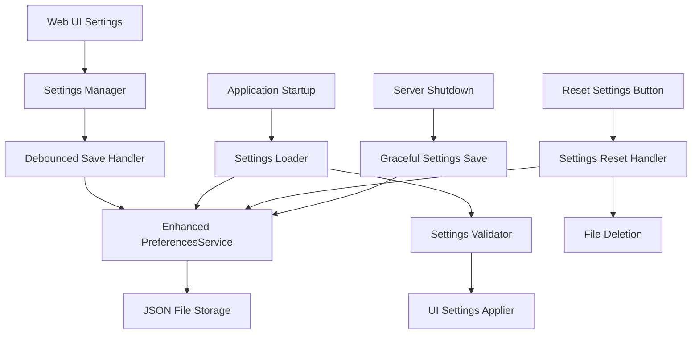

# Design Document

## Overview

The Settings Persistence system extends the existing pi-audio-kiosk application to automatically save and restore all user interface settings. The system integrates with the existing PreferencesService to store UI-specific settings alongside system preferences, providing a seamless user experience where all customizations are preserved across application sessions.

## Architecture

### High-Level Architecture



### Integration with Existing System

The settings persistence system builds upon the existing PreferencesService architecture:

1. **Extends PreferencesService Schema**: Adds UI settings to the existing preferences structure
2. **Leverages Existing Infrastructure**: Uses the same JSON file storage, validation, and error handling
3. **Maintains Backward Compatibility**: Existing system preferences remain unchanged
4. **Reuses Platform Detection**: Uses existing cross-platform file path handling

## Components and Interfaces

### 1. Enhanced PreferencesService (`services/preferencesService.js`)

**Purpose**: Extend existing service to handle UI settings alongside system preferences

**New Responsibilities**:
- Store and retrieve UI-specific settings
- Validate UI setting values and ranges
- Provide UI settings defaults
- Handle UI settings schema evolution

**Extended Schema**:
```javascript
{
  // Existing system preferences
  selectedAudioDevice: "string",
  audioSettings: { ... },
  systemSettings: { ... },
  
  // New UI settings section
  uiSettings: {
    // General tab settings
    general: {
      minFrequency: 20,
      maxFrequency: 20000,
      inputGain: 0.0,
      holdMode: "latch"
    },
    
    // Spectrogram Interface tab settings
    spectrogramInterface: {
      clickInfoSize: "large",
      responsiveness: 90,
      amplitudeOffset: 0.0,
      overlappingDisplay: true,
      overlapTolerance: 1.0,
      spectrogramRange: -100
    },
    
    // Spectrogram Drawing tab settings
    spectrogramDrawing: {
      fftSize: 4096,
      pixelAveraging: true,
      multiPixelSmoothing: 3,
      frequencyDependentSmoothing: true,
      noiseFloorSubtraction: 0,
      peakEnvelope: true
    },
    
    // Meters tab settings
    meters: {
      meterSpeed: "medium",
      holdTime: 0.5,
      decibelsSpeed: 150,
      rmsWeighting: "Z"
    }
  },
  
  lastUpdated: "string"
}
```

### 2. Client-Side Settings Manager (`public/js/settings-persistence.js`)

**Purpose**: Handle UI settings persistence on the client side

**Key Responsibilities**:
- Monitor all settings controls for changes
- Debounce rapid setting changes
- Send settings updates to server
- Apply loaded settings to UI controls
- Handle settings reset functionality
- Provide user feedback for save/load operations

**Interface**:
```javascript
class SettingsManager {
  constructor()
  
  // Core functionality
  async loadSettings()
  async saveSettings(settings)
  async resetSettings()
  
  // UI integration
  attachSettingsListeners()
  applySettingsToUI(settings)
  collectCurrentSettings()
  
  // Utility methods
  debounceSettingsSave()
  validateSettingValue(key, value)
  showSettingsFeedback(message, type)
}
```

### 3. Settings Validation Module

**Purpose**: Validate UI settings values and ranges

**Validation Rules**:
```javascript
const UI_SETTINGS_SCHEMA = {
  general: {
    minFrequency: { type: 'number', min: 20, max: 500 },
    maxFrequency: { type: 'number', min: 6000, max: 20000 },
    inputGain: { type: 'number', min: -30, max: 12 },
    holdMode: { type: 'string', enum: ['latch', 'temporary'] }
  },
  spectrogramInterface: {
    clickInfoSize: { type: 'string', enum: ['small', 'large'] },
    responsiveness: { type: 'number', min: 1, max: 100 },
    amplitudeOffset: { type: 'number', min: -15, max: 15 },
    overlappingDisplay: { type: 'boolean' },
    overlapTolerance: { type: 'number', min: 0.1, max: 2.0 },
    spectrogramRange: { type: 'number', min: -100, max: -50 }
  },
  spectrogramDrawing: {
    fftSize: { type: 'number', enum: [512, 1024, 2048, 4096, 8192, 16384, 32768] },
    pixelAveraging: { type: 'boolean' },
    multiPixelSmoothing: { type: 'number', min: 1, max: 5 },
    frequencyDependentSmoothing: { type: 'boolean' },
    noiseFloorSubtraction: { type: 'number', min: 0, max: 20 },
    peakEnvelope: { type: 'boolean' }
  },
  meters: {
    meterSpeed: { type: 'string', enum: ['slow', 'medium', 'fast'] },
    holdTime: { type: 'number', min: 0.5, max: 2.0 },
    decibelsSpeed: { type: 'number', min: 10, max: 250 },
    rmsWeighting: { type: 'string', enum: ['Z', 'A', 'C'] }
  }
};
```

### 4. Server-Side Settings API Extensions

**Purpose**: Extend existing preferences API to handle UI settings

**New/Enhanced Endpoints**:
- `GET /api/preferences` - Returns both system and UI preferences
- `POST /api/preferences` - Saves both system and UI preferences
- `DELETE /api/preferences` - Resets preferences and deletes file (new endpoint)
- `GET /api/preferences/ui` - Returns only UI settings (new endpoint)
- `POST /api/preferences/ui` - Saves only UI settings (new endpoint)

### 5. Reset Settings Component

**Purpose**: Provide settings reset functionality

**Implementation**:
- Add "Reset Settings" button to General tab
- Immediate reset without confirmation (touch-screen optimized)
- Delete settings file from disk
- Apply default values to UI
- Provide user feedback

## Data Models

### UI Settings Model
```javascript
{
  general: {
    minFrequency: number,        // 20-500 Hz
    maxFrequency: number,        // 6000-20000 Hz
    inputGain: number,           // -30 to +12 dB
    holdMode: string             // "latch" | "temporary"
  },
  spectrogramInterface: {
    clickInfoSize: string,       // "small" | "large"
    responsiveness: number,      // 1-100
    amplitudeOffset: number,     // -15 to +15 dB
    overlappingDisplay: boolean,
    overlapTolerance: number,    // 0.1-2.0 dB
    spectrogramRange: number     // -100 to -50 dB
  },
  spectrogramDrawing: {
    fftSize: number,             // 512, 1024, 2048, 4096, 8192, 16384, 32768
    pixelAveraging: boolean,
    multiPixelSmoothing: number, // 1-5
    frequencyDependentSmoothing: boolean,
    noiseFloorSubtraction: number, // 0-20 dB
    peakEnvelope: boolean
  },
  meters: {
    meterSpeed: string,          // "slow" | "medium" | "fast"
    holdTime: number,            // 0.5-2.0 seconds
    decibelsSpeed: number,       // 10-250 ms
    rmsWeighting: string         // "Z" | "A" | "C"
  }
}
```

### Settings File Location Strategy
```javascript
// Platform-specific paths (using existing PlatformDetection)
const SETTINGS_PATHS = {
  darwin: '~/.config/pi-audio-kiosk/preferences.json',
  linux: '~/.config/pi-audio-kiosk/preferences.json',
  win32: '%APPDATA%/pi-audio-kiosk/preferences.json'
};
```

## Error Handling

### Client-Side Error Handling
- **Network Errors**: Retry mechanism with exponential backoff
- **Validation Errors**: Show user-friendly error messages
- **Save Failures**: Queue settings for retry on next successful connection
- **Load Failures**: Fall back to default values with user notification

### Server-Side Error Handling
- **File System Errors**: Use existing PreferencesService error handling
- **Validation Errors**: Return detailed validation error messages
- **Corruption Recovery**: Backup corrupted files and create new defaults
- **Permission Errors**: Graceful degradation with in-memory settings

### Settings Validation Errors
```javascript
// Example validation error response
{
  success: false,
  error: 'VALIDATION_ERROR',
  message: 'Invalid settings values',
  details: {
    'general.minFrequency': 'Value must be between 20 and 500',
    'meters.holdTime': 'Value must be between 0.5 and 2.0'
  }
}
```

## Testing Strategy

### Unit Testing
- **Settings Validation**: Test all validation rules and edge cases
- **Settings Persistence**: Test save/load operations with mocked file system
- **Error Recovery**: Test corruption recovery and fallback mechanisms
- **Schema Evolution**: Test handling of old settings file formats

### Integration Testing
- **End-to-End Settings Flow**: Test complete save/load/reset cycle
- **UI Integration**: Test settings application to all UI controls
- **Server Integration**: Test API endpoints with various settings payloads
- **Cross-Platform**: Test settings persistence on different operating systems

### User Experience Testing
- **Settings Persistence**: Verify all settings are preserved across restarts
- **Reset Functionality**: Test complete settings reset and UI update
- **Error Feedback**: Test user feedback for various error conditions
- **Performance**: Ensure settings operations don't impact UI responsiveness

## Security Considerations

### Input Validation
- Validate all settings values on both client and server side
- Sanitize file paths to prevent directory traversal
- Limit settings file size to prevent disk space attacks

### File System Security
- Use existing PreferencesService security measures
- Validate file permissions and ownership
- Handle symbolic links securely

### API Security
- Rate limit settings save operations
- Validate request payloads thoroughly
- Log suspicious settings modification attempts

## Implementation Phases

### Phase 1: Server-Side Foundation
1. Extend PreferencesService schema for UI settings
2. Add UI settings validation rules
3. Enhance existing API endpoints
4. Add settings reset endpoint

### Phase 2: Client-Side Integration
1. Create SettingsManager class
2. Implement settings collection from UI
3. Add debounced save functionality
4. Implement settings application to UI

### Phase 3: Reset Functionality
1. Add Reset Settings button to UI
2. Implement confirmation dialog
3. Connect to server reset endpoint
4. Handle reset feedback and UI updates

### Phase 4: Shutdown Integration
1. Enhance server shutdown handlers
2. Ensure settings save during graceful shutdown
3. Handle emergency shutdown scenarios
4. Add startup settings loading

### Phase 5: Error Handling & Polish
1. Implement comprehensive error handling
2. Add user feedback mechanisms
3. Optimize performance and debouncing
4. Add logging and monitoring

## Performance Considerations

### Debouncing Strategy
- Debounce rapid setting changes (500ms delay)
- Batch multiple setting changes into single save operation
- Use requestIdleCallback for non-critical saves

### Memory Efficiency
- Avoid storing duplicate settings data
- Use efficient JSON serialization
- Clean up event listeners properly

### Network Efficiency
- Only send changed settings, not entire settings object
- Compress settings payload for large configurations
- Implement client-side caching with cache invalidation

## Monitoring and Logging

### Settings Operations Logging
```javascript
// Example log entries
logger.info('UI settings saved', { 
  settingsCount: 15, 
  changedSettings: ['general.inputGain', 'meters.holdTime'],
  saveTime: '45ms'
});

logger.warn('Settings validation failed', {
  invalidSettings: ['general.minFrequency'],
  providedValue: 15,
  expectedRange: '20-500'
});
```

### Performance Metrics
- Settings save/load operation times
- Settings file size growth over time
- Validation failure rates
- Reset operation frequency